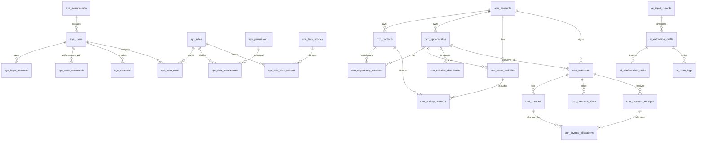

# 项目型大客户CRM数据库模型

版本：V1.0

日期：2026-06-17

依据文档：

- [项目型大客户CRM系统设计文档](/Users/shensiwei/AIJob/codex_presolution/docs/superpowers/specs/2026-06-17-project-crm-design.md)
- [项目型大客户CRM系统PRD](/Users/shensiwei/AIJob/codex_presolution/docs/prd/project-crm-prd.md)

## 1. 建模原则

- 使用客户、联系人、商机、销售行动、方案与标书、合同、开票、回款、AI助手作为核心业务域。
- 商机阶段和商机状态拆分，避免成交、关闭、取消跟进与业务阶段混淆。
- 商机周进展不作为商机主表字段，由销售行动聚合生成视图。
- 回款与发票采用多对多核销模型，通过发票核销明细表承接。
- AI销售助手采用输入记录、提取草稿、确认任务、写入日志四类对象。
- 金额字段使用 `decimal(18,2)`，比例字段使用 `decimal(8,4)`。
- 枚举字段可先使用字符串编码，后续可抽象为数据字典表。
- 所有核心表保留创建、更新、软删除和审计字段。

## 2. 通用字段规范

除特别说明外，核心业务表建议包含以下通用字段：

| 字段 | 类型 | 说明 |
|---|---|---|
| id | bigint/uuid | 主键 |
| tenant_id | bigint/uuid | 租户或组织ID，单组织部署可预留 |
| created_by | bigint/uuid | 创建人 |
| created_at | datetime | 创建时间 |
| updated_by | bigint/uuid | 更新人 |
| updated_at | datetime | 更新时间 |
| deleted_at | datetime nullable | 软删除时间 |
| version | int | 乐观锁版本 |

## 3. 核心实体关系图

## 4. 系统基础、组织与权限域

### 4.1 sys_departments

组织部门表，用于维护部门、团队、上下级组织和销售区域。

| 字段 | 类型 | 约束 | 说明 |
|---|---|---|---|
| id | bigint/uuid | PK | 部门ID |
| parent_id | bigint/uuid nullable | FK -> sys_departments.id | 上级部门 |
| name | varchar(128) | not null | 部门名称 |
| code | varchar(64) | unique | 部门编码 |
| region_code | varchar(64) |  | 销售区域编码 |
| manager_user_id | bigint/uuid nullable | FK -> sys_users.id | 部门负责人 |
| status | varchar(32) | not null | active, inactive |

### 4.2 sys_users

用户基础资料表。登录账号和密码凭据不直接放在该表中。

| 字段 | 类型 | 约束 | 说明 |
|---|---|---|---|
| id | bigint/uuid | PK | 用户ID |
| department_id | bigint/uuid | FK -> sys_departments.id | 所属部门 |
| name | varchar(64) | not null | 姓名 |
| mobile | varchar(32) |  | 手机 |
| email | varchar(128) |  | 邮箱 |
| role_code | varchar(64) | not null | 主角色编码 |
| status | varchar(32) | not null | active, inactive |
| last_login_at | datetime nullable |  | 最近登录时间 |
| force_password_change | boolean | default false | 是否强制改密 |

### 4.3 sys_roles

角色表。

| 字段 | 类型 | 约束 | 说明 |
|---|---|---|---|
| id | bigint/uuid | PK | 角色ID |
| code | varchar(64) | unique | 角色编码 |
| name | varchar(64) | not null | 角色名称 |
| description | text |  | 说明 |

### 4.4 sys_user_roles

用户角色关联表。

| 字段 | 类型 | 约束 | 说明 |
|---|---|---|---|
| user_id | bigint/uuid | FK -> sys_users.id | 用户ID |
| role_id | bigint/uuid | FK -> sys_roles.id | 角色ID |

主键：`(user_id, role_id)`

### 4.5 sys_login_accounts

登录账号表。一个用户可按需绑定多个登录账号，例如手机号、邮箱、工号或第三方SSO标识。

| 字段 | 类型 | 约束 | 说明 |
|---|---|---|---|
| id | bigint/uuid | PK | 登录账号ID |
| user_id | bigint/uuid | FK -> sys_users.id | 用户ID |
| login_type | varchar(32) | not null | username, mobile, email, sso |
| login_identifier | varchar(255) | not null | 登录标识 |
| is_primary | boolean | default false | 是否主账号 |
| status | varchar(32) | not null | active, locked, disabled |
| locked_until | datetime nullable |  | 锁定截止时间 |
| failed_login_count | int | default 0 | 连续失败次数 |
| last_failed_login_at | datetime nullable |  | 最近失败时间 |

唯一索引：

- `uk_login_accounts_identifier(login_type, login_identifier)`

索引建议：

- `idx_login_accounts_user(user_id)`
- `idx_login_accounts_status(status)`

### 4.6 sys_user_credentials

用户认证凭据表。密码必须加密存储，不允许保存明文。

| 字段 | 类型 | 约束 | 说明 |
|---|---|---|---|
| id | bigint/uuid | PK | 凭据ID |
| user_id | bigint/uuid | FK -> sys_users.id | 用户ID |
| credential_type | varchar(32) | not null | password, sso |
| password_hash | varchar(255) |  | 密码哈希 |
| password_salt | varchar(128) |  | 盐值，视算法需要 |
| password_algo | varchar(64) |  | bcrypt, argon2id等 |
| password_updated_at | datetime nullable |  | 最近改密时间 |
| password_expires_at | datetime nullable |  | 密码过期时间 |
| status | varchar(32) | not null | active, expired, disabled |

索引建议：

- `idx_user_credentials_user(user_id)`

### 4.7 sys_sessions

用户会话表。

| 字段 | 类型 | 约束 | 说明 |
|---|---|---|---|
| id | bigint/uuid | PK | 会话ID |
| user_id | bigint/uuid | FK -> sys_users.id | 用户ID |
| session_token_hash | varchar(255) | unique | 会话令牌哈希 |
| login_account_id | bigint/uuid | FK -> sys_login_accounts.id | 登录账号 |
| ip_address | varchar(64) |  | 登录IP |
| user_agent | varchar(512) |  | 浏览器或客户端 |
| created_at | datetime | not null | 创建时间 |
| expires_at | datetime | not null | 过期时间 |
| revoked_at | datetime nullable |  | 失效时间 |
| revoke_reason | varchar(128) |  | 登出、强制下线、过期等 |

索引建议：

- `idx_sessions_user(user_id)`
- `idx_sessions_expires(expires_at)`

### 4.8 sys_password_reset_tokens

密码重置令牌表。

| 字段 | 类型 | 约束 | 说明 |
|---|---|---|---|
| id | bigint/uuid | PK | 令牌ID |
| user_id | bigint/uuid | FK -> sys_users.id | 用户ID |
| token_hash | varchar(255) | unique | 重置令牌哈希 |
| reset_channel | varchar(32) | not null | admin, email, sms |
| expires_at | datetime | not null | 过期时间 |
| used_at | datetime nullable |  | 使用时间 |
| created_by | bigint/uuid nullable | FK -> sys_users.id | 创建人 |
| created_at | datetime | not null | 创建时间 |

索引建议：

- `idx_reset_tokens_user(user_id)`
- `idx_reset_tokens_expires(expires_at)`

### 4.9 sys_permissions

权限点表，统一承载菜单权限和操作权限。

| 字段 | 类型 | 约束 | 说明 |
|---|---|---|---|
| id | bigint/uuid | PK | 权限ID |
| permission_code | varchar(128) | unique | 权限编码 |
| permission_name | varchar(128) | not null | 权限名称 |
| permission_type | varchar(32) | not null | menu, action, api |
| module_code | varchar(64) | not null | 模块编码 |
| parent_id | bigint/uuid nullable | FK -> sys_permissions.id | 上级权限 |
| sort_order | int | default 0 | 排序 |
| is_active | boolean | default true | 是否启用 |

### 4.10 sys_role_permissions

角色权限关联表。

| 字段 | 类型 | 约束 | 说明 |
|---|---|---|---|
| role_id | bigint/uuid | FK -> sys_roles.id | 角色ID |
| permission_id | bigint/uuid | FK -> sys_permissions.id | 权限ID |

主键：`(role_id, permission_id)`

### 4.11 sys_data_scopes

数据范围定义表。

| 字段 | 类型 | 约束 | 说明 |
|---|---|---|---|
| id | bigint/uuid | PK | 数据范围ID |
| scope_code | varchar(64) | unique | own, department, department_tree, collaborated, global, custom |
| scope_name | varchar(128) | not null | 数据范围名称 |
| description | text |  | 说明 |

### 4.12 sys_role_data_scopes

角色数据范围关联表。

| 字段 | 类型 | 约束 | 说明 |
|---|---|---|---|
| role_id | bigint/uuid | FK -> sys_roles.id | 角色ID |
| module_code | varchar(64) | not null | 模块编码 |
| data_scope_id | bigint/uuid | FK -> sys_data_scopes.id | 数据范围ID |

主键：`(role_id, module_code, data_scope_id)`

### 4.13 sys_login_logs

登录日志表。

| 字段 | 类型 | 约束 | 说明 |
|---|---|---|---|
| id | bigint/uuid | PK | 日志ID |
| user_id | bigint/uuid nullable | FK -> sys_users.id | 用户ID |
| login_identifier | varchar(255) |  | 登录标识 |
| event_type | varchar(64) | not null | login_success, login_failed, logout, locked, session_expired |
| success | boolean | not null | 是否成功 |
| failure_reason | varchar(255) |  | 失败原因 |
| ip_address | varchar(64) |  | IP |
| user_agent | varchar(512) |  | 客户端 |
| occurred_at | datetime | not null | 发生时间 |

索引建议：

- `idx_login_logs_user_time(user_id, occurred_at)`
- `idx_login_logs_identifier(login_identifier)`

### 4.14 sys_audit_logs

通用操作审计日志表。

| 字段 | 类型 | 约束 | 说明 |
|---|---|---|---|
| id | bigint/uuid | PK | 审计ID |
| actor_user_id | bigint/uuid nullable | FK -> sys_users.id | 操作人 |
| action_code | varchar(128) | not null | 操作编码 |
| module_code | varchar(64) | not null | 模块编码 |
| object_type | varchar(64) | not null | 业务对象类型 |
| object_id | bigint/uuid nullable |  | 业务对象ID |
| before_data | json |  | 变更前数据 |
| after_data | json |  | 变更后数据 |
| ip_address | varchar(64) |  | IP |
| user_agent | varchar(512) |  | 客户端 |
| occurred_at | datetime | not null | 操作时间 |
| result | varchar(64) | not null | success, failed |
| failure_reason | text |  | 失败原因 |

索引建议：

- `idx_audit_logs_actor_time(actor_user_id, occurred_at)`
- `idx_audit_logs_object(object_type, object_id)`
- `idx_audit_logs_module_time(module_code, occurred_at)`

## 5. 客户域

### 5.1 crm_accounts

客户池主表。

| 字段 | 类型 | 约束 | 说明 |
|---|---|---|---|
| id | bigint/uuid | PK | 客户ID |
| parent_id | bigint/uuid nullable | FK -> crm_accounts.id | 上级客户 |
| account_name | varchar(255) | not null | 客户名称 |
| account_short_name | varchar(128) |  | 客户简称 |
| account_type | varchar(64) | not null | group, subsidiary, government, institution, enterprise, partner |
| industry | varchar(64) |  | 所属行业 |
| region_province | varchar(64) |  | 省 |
| region_city | varchar(64) |  | 市 |
| region_district | varchar(64) |  | 区县 |
| account_level | varchar(32) |  | A, B, C, D |
| account_status | varchar(32) | not null | potential, following, cooperating, paused, lost |
| account_source | varchar(64) |  | self_developed, referral, partner, bidding, existing, campaign |
| owner_department_id | bigint/uuid | FK -> sys_departments.id | 归属部门 |
| owner_user_id | bigint/uuid | FK -> sys_users.id | 客户负责人 |
| background | text |  | 客户背景 |
| key_needs | text |  | 重点需求方向 |
| relationship_status | varchar(32) |  | stranger, contacted, stable, breakthrough, risk |
| last_activity_at | datetime nullable |  | 最近跟进时间 |
| last_activity_summary | text |  | 最近跟进摘要 |
| next_follow_up_at | datetime nullable |  | 下次跟进时间 |
| remark | text |  | 备注 |

索引建议：

- `idx_accounts_owner_user(owner_user_id)`
- `idx_accounts_parent(parent_id)`
- `idx_accounts_level_status(account_level, account_status)`
- `idx_accounts_last_activity(last_activity_at)`

### 5.2 crm_account_collaborators

客户协同人员表。

| 字段 | 类型 | 约束 | 说明 |
|---|---|---|---|
| account_id | bigint/uuid | FK -> crm_accounts.id | 客户ID |
| user_id | bigint/uuid | FK -> sys_users.id | 协同人员 |
| collaborator_role | varchar(64) |  | sales, presales, delivery, manager |

主键：`(account_id, user_id)`

### 5.3 crm_account_attachments

客户附件表。

| 字段 | 类型 | 约束 | 说明 |
|---|---|---|---|
| id | bigint/uuid | PK | 附件ID |
| account_id | bigint/uuid | FK -> crm_accounts.id | 客户ID |
| file_name | varchar(255) | not null | 文件名 |
| file_url | varchar(1024) | not null | 文件地址 |
| file_type | varchar(64) |  | 文件类型 |
| uploaded_by | bigint/uuid | FK -> sys_users.id | 上传人 |
| uploaded_at | datetime | not null | 上传时间 |

## 6. 联系人与干系人域

### 6.1 crm_contacts

联系人与干系人主表。

| 字段 | 类型 | 约束 | 说明 |
|---|---|---|---|
| id | bigint/uuid | PK | 联系人ID |
| account_id | bigint/uuid | FK -> crm_accounts.id | 所属客户 |
| name | varchar(128) | not null | 姓名 |
| department_name | varchar(128) |  | 所属单位/部门 |
| title | varchar(128) |  | 职务 |
| mobile | varchar(32) |  | 手机 |
| wechat | varchar(128) |  | 微信 |
| email | varchar(128) |  | 邮箱 |
| office_address | varchar(255) |  | 办公地址 |
| contact_type | varchar(64) |  | decision_maker, user, technical, procurement, finance, influencer, partner |
| decision_influence | varchar(32) |  | high, medium, low, unknown |
| attitude | varchar(32) |  | supportive, neutral, wait_and_see, opposed, unknown |
| relationship_heat | varchar(32) |  | stranger, contacted, familiar, trusted, key |
| importance_level | varchar(32) |  | core, important, normal |
| next_action | text |  | 下一步经营动作 |
| birthday | date nullable |  | 生日 |
| anniversary | date nullable |  | 纪念日 |
| last_communication_at | datetime nullable |  | 最近沟通时间 |
| last_communication_summary | text |  | 最近沟通摘要 |
| remark | text |  | 备注 |

索引建议：

- `idx_contacts_account(account_id)`
- `idx_contacts_type(contact_type)`
- `idx_contacts_attitude(attitude)`

### 6.2 crm_contact_project_roles

联系人项目角色表，用于一个联系人拥有多个项目角色。

| 字段 | 类型 | 约束 | 说明 |
|---|---|---|---|
| contact_id | bigint/uuid | FK -> crm_contacts.id | 联系人ID |
| role_code | varchar(64) | not null | demand_owner, budget_promoter, technical_gatekeeper, procurement_executor, contract_approver, acceptance_owner |

主键：`(contact_id, role_code)`

## 7. 商机域

### 7.1 crm_opportunities

商机主表。

| 字段 | 类型 | 约束 | 说明 |
|---|---|---|---|
| id | bigint/uuid | PK | 商机ID |
| account_id | bigint/uuid | FK -> crm_accounts.id | 所属客户 |
| opportunity_name | varchar(255) | not null | 商机名称 |
| stage | varchar(64) | not null | lead, validation, solution, negotiation, won |
| status | varchar(64) | not null | following, paused, closed, cancelled |
| level | varchar(32) |  | 1, 2, 3 或 A, B, C |
| source | varchar(64) |  | customer, policy_fund, partner, bidding, existing, campaign |
| potential_point | text |  | 潜在机会点 |
| opportunity_analysis | text |  | 机会点分析 |
| project_requirement | text |  | 项目需求 |
| estimated_budget_amount | decimal(18,2) |  | 预计预算 |
| estimated_contract_amount | decimal(18,2) |  | 预计合同金额 |
| estimated_gross_margin_rate | decimal(8,4) |  | 预计毛利率 |
| expected_close_date | date |  | 预计成交时间 |
| project_cycle | varchar(255) |  | 项目周期 |
| procurement_process | text |  | 采购流程 |
| funding_source | varchar(128) |  | 资金来源 |
| owner_user_id | bigint/uuid | FK -> sys_users.id | 责任人 |
| technical_solution_status | varchar(64) |  | not_started, researching, drafting, submitted, reviewed |
| stakeholder_plan_status | varchar(64) |  | not_started, identified, managing, breakthrough, risk |
| quotation_status | varchar(64) |  | not_started, calculating, calculated, review_required |
| bid_self_check_status | varchar(64) |  | not_applicable, pending, completed, risk |
| current_progress | text |  | 当前进展 |
| next_plan | text |  | 下一步计划 |
| risk_status | varchar(32) |  | normal, attention, risk, high_risk |
| risk_description | text |  | 风险说明 |
| win_rate | decimal(8,4) |  | 赢率 |
| last_activity_at | datetime nullable |  | 最近跟进时间 |
| last_activity_summary | text |  | 最近跟进摘要 |
| close_type | varchar(64) |  | won, lost, invalid, cancelled |
| close_reason | varchar(128) |  | 关闭原因 |
| close_description | text |  | 关闭说明 |
| closed_at | datetime nullable |  | 关闭时间 |
| closed_by | bigint/uuid nullable | FK -> sys_users.id | 关闭操作人 |
| can_reopen | boolean | default false | 是否可重启 |
| remark | text |  | 备注 |

索引建议：

- `idx_opportunities_account(account_id)`
- `idx_opportunities_owner(owner_user_id)`
- `idx_opportunities_stage_status(stage, status)`
- `idx_opportunities_expected_close(expected_close_date)`
- `idx_opportunities_risk(risk_status)`

### 7.2 crm_opportunity_collaborators

商机协同人员表。

| 字段 | 类型 | 约束 | 说明 |
|---|---|---|---|
| opportunity_id | bigint/uuid | FK -> crm_opportunities.id | 商机ID |
| user_id | bigint/uuid | FK -> sys_users.id | 协同人员 |
| collaborator_role | varchar(64) |  | sales, presales, solution, manager |

主键：`(opportunity_id, user_id)`

### 7.3 crm_opportunity_contacts

商机联系人关联表。

| 字段 | 类型 | 约束 | 说明 |
|---|---|---|---|
| opportunity_id | bigint/uuid | FK -> crm_opportunities.id | 商机ID |
| contact_id | bigint/uuid | FK -> crm_contacts.id | 联系人ID |
| role_in_opportunity | varchar(64) |  | decision_maker, user, technical, procurement, finance, influencer, partner |
| is_key_person | boolean | default false | 是否关键人 |

主键：`(opportunity_id, contact_id)`

### 7.4 v_opportunity_weekly_progress

商机周进展视图。该视图由销售行动聚合生成，不落商机主表。

建议字段：

| 字段 | 来源 | 说明 |
|---|---|---|
| opportunity_id | crm_sales_activities.opportunity_id | 商机ID |
| week_start_date | 聚合计算 | 周开始日期 |
| week_end_date | 聚合计算 | 周结束日期 |
| activity_count | count | 行动数量 |
| progress_items | 聚合文本/JSON | 形成结论、下一步计划、风险说明明细 |
| latest_activity_at | max(activity_time) | 最近行动时间 |

过滤条件：

- `activity_status = completed`
- `include_in_weekly_progress = true`
- `opportunity_id is not null`

## 8. 销售行动域

### 8.1 crm_sales_activities

销售行动主表。

| 字段 | 类型 | 约束 | 说明 |
|---|---|---|---|
| id | bigint/uuid | PK | 行动ID |
| subject | varchar(255) | not null | 行动主题 |
| activity_type | varchar(64) | not null | visit, meeting, phone, wechat, email, solution_presentation, demo, bidding_communication, payment_followup, internal_collaboration |
| account_id | bigint/uuid | FK -> crm_accounts.id | 关联客户 |
| opportunity_id | bigint/uuid nullable | FK -> crm_opportunities.id | 关联商机 |
| owner_user_id | bigint/uuid | FK -> sys_users.id | 责任人 |
| activity_time | datetime | not null | 行动时间 |
| activity_status | varchar(32) | not null | pending, completed, cancelled, postponed |
| activity_result | varchar(64) |  | progressed, no_progress, waiting_customer, risk_found, milestone_completed |
| communication_content | text |  | 沟通内容 |
| customer_feedback | text |  | 客户反馈 |
| conclusion | text |  | 形成结论 |
| next_plan | text |  | 下一步计划 |
| next_follow_up_at | datetime nullable |  | 下次跟进时间 |
| risk_description | text |  | 风险说明 |
| include_in_weekly_progress | boolean | default true | 是否进入周进展 |
| weekly_period | varchar(64) |  | 自然周或月内周 |
| source_type | varchar(64) |  | manual, ai, imported |
| source_ai_draft_id | bigint/uuid nullable | FK -> ai_extraction_drafts.id | 来源AI草稿 |
| remark | text |  | 备注 |

索引建议：

- `idx_activities_account(account_id)`
- `idx_activities_opportunity(opportunity_id)`
- `idx_activities_owner_time(owner_user_id, activity_time)`
- `idx_activities_status_time(activity_status, activity_time)`

### 8.2 crm_activity_contacts

销售行动联系人关联表。

| 字段 | 类型 | 约束 | 说明 |
|---|---|---|---|
| activity_id | bigint/uuid | FK -> crm_sales_activities.id | 行动ID |
| contact_id | bigint/uuid | FK -> crm_contacts.id | 联系人ID |

主键：`(activity_id, contact_id)`

### 8.3 crm_activity_participants

销售行动我方参与人员表。

| 字段 | 类型 | 约束 | 说明 |
|---|---|---|---|
| activity_id | bigint/uuid | FK -> crm_sales_activities.id | 行动ID |
| user_id | bigint/uuid | FK -> sys_users.id | 参与人 |

主键：`(activity_id, user_id)`

### 8.4 crm_activity_risk_types

销售行动风险类型表。

| 字段 | 类型 | 约束 | 说明 |
|---|---|---|---|
| activity_id | bigint/uuid | FK -> crm_sales_activities.id | 行动ID |
| risk_type | varchar(64) | not null | budget, relationship, competition, technical, procurement, delivery, contract, payment |

主键：`(activity_id, risk_type)`

## 9. 方案与标书域

### 9.1 crm_solution_documents

方案与标书主表。

| 字段 | 类型 | 约束 | 说明 |
|---|---|---|---|
| id | bigint/uuid | PK | 材料ID |
| account_id | bigint/uuid | FK -> crm_accounts.id | 关联客户 |
| opportunity_id | bigint/uuid | FK -> crm_opportunities.id | 关联商机 |
| document_name | varchar(255) | not null | 方案/标书名称 |
| document_type | varchar(64) | not null | requirement, technical_solution, stakeholder_plan, quotation, profit_calculation, bid_document, bid_self_check, demo_material |
| version_no | varchar(64) |  | 版本号 |
| status | varchar(64) | not null | pending, drafting, internal_review, revision_required, submitted, customer_feedback, finalized, voided |
| owner_user_id | bigint/uuid | FK -> sys_users.id | 负责人 |
| customer_requirement_summary | text |  | 客户需求摘要 |
| technical_solution_summary | text |  | 技术方案摘要 |
| stakeholder_strategy | text |  | 干系人策略 |
| quotation_amount | decimal(18,2) |  | 报价金额 |
| cost_amount | decimal(18,2) |  | 成本测算 |
| estimated_gross_margin_rate | decimal(8,4) |  | 预计毛利率 |
| bid_self_check_result | varchar(64) |  | not_applicable, passed, risk, failed |
| bid_risk_description | text |  | 标书风险说明 |
| submitted_to_customer_at | datetime nullable |  | 提交客户时间 |
| customer_feedback | text |  | 客户反馈 |
| remark | text |  | 备注 |

索引建议：

- `idx_solution_documents_opportunity(opportunity_id)`
- `idx_solution_documents_status(status)`
- `idx_solution_documents_owner(owner_user_id)`

### 9.2 crm_solution_collaborators

方案与标书协同人员表。

| 字段 | 类型 | 约束 | 说明 |
|---|---|---|---|
| document_id | bigint/uuid | FK -> crm_solution_documents.id | 材料ID |
| user_id | bigint/uuid | FK -> sys_users.id | 协同人员 |
| collaborator_role | varchar(64) |  | sales, presales, delivery, business, manager |

主键：`(document_id, user_id)`

### 9.3 crm_solution_attachments

方案与标书附件表。

| 字段 | 类型 | 约束 | 说明 |
|---|---|---|---|
| id | bigint/uuid | PK | 附件ID |
| document_id | bigint/uuid | FK -> crm_solution_documents.id | 材料ID |
| file_name | varchar(255) | not null | 文件名 |
| file_url | varchar(1024) | not null | 文件地址 |
| file_type | varchar(64) |  | 文件类型 |
| uploaded_by | bigint/uuid | FK -> sys_users.id | 上传人 |
| uploaded_at | datetime | not null | 上传时间 |

## 10. 合同域

### 10.1 crm_contracts

合同主表。

| 字段 | 类型 | 约束 | 说明 |
|---|---|---|---|
| id | bigint/uuid | PK | 合同ID |
| account_id | bigint/uuid | FK -> crm_accounts.id | 关联客户 |
| opportunity_id | bigint/uuid | FK -> crm_opportunities.id | 来源商机 |
| contract_name | varchar(255) | not null | 合同名称 |
| contract_no | varchar(128) | unique | 合同编号 |
| contract_type | varchar(64) | not null | project, framework, procurement, service, supplement |
| contract_status | varchar(64) | not null | drafting, approving, pending_signature, performing, paused, completed, terminated |
| contract_amount | decimal(18,2) | not null | 含税合同金额 |
| tax_rate | decimal(8,4) |  | 税率 |
| net_amount | decimal(18,2) |  | 不含税金额 |
| our_signing_entity | varchar(255) |  | 我方签约主体 |
| customer_signing_entity | varchar(255) |  | 客户签约主体 |
| owner_user_id | bigint/uuid | FK -> sys_users.id | 合同负责人 |
| business_owner_id | bigint/uuid | FK -> sys_users.id | 商务负责人 |
| signed_at | date nullable |  | 签署日期 |
| effective_at | date nullable |  | 生效日期 |
| ended_at | date nullable |  | 结束日期 |
| payment_terms | text |  | 付款条件 |
| invoice_terms | text |  | 开票条件 |
| delivery_scope | text |  | 交付范围 |
| acceptance_criteria | text |  | 验收标准 |
| risk_level | varchar(32) |  | normal, attention, risk, high_risk |
| risk_description | text |  | 风险说明 |
| remark | text |  | 备注 |

索引建议：

- `idx_contracts_account(account_id)`
- `idx_contracts_opportunity(opportunity_id)`
- `idx_contracts_status(contract_status)`
- `idx_contracts_owner(owner_user_id)`

### 10.2 crm_contract_changes

合同变更表。

| 字段 | 类型 | 约束 | 说明 |
|---|---|---|---|
| id | bigint/uuid | PK | 变更ID |
| contract_id | bigint/uuid | FK -> crm_contracts.id | 合同ID |
| change_type | varchar(64) | not null | amount, scope, payment_terms, invoice_terms, other |
| before_value | text |  | 变更前 |
| after_value | text |  | 变更后 |
| change_reason | text |  | 变更原因 |
| changed_by | bigint/uuid | FK -> sys_users.id | 变更人 |
| changed_at | datetime | not null | 变更时间 |

### 10.3 crm_contract_milestones

合同交付/验收节点表。

| 字段 | 类型 | 约束 | 说明 |
|---|---|---|---|
| id | bigint/uuid | PK | 节点ID |
| contract_id | bigint/uuid | FK -> crm_contracts.id | 合同ID |
| milestone_name | varchar(128) | not null | 节点名称 |
| milestone_type | varchar(64) | not null | kickoff, delivery, initial_acceptance, final_acceptance, warranty |
| planned_at | date |  | 计划日期 |
| actual_at | date nullable |  | 实际完成日期 |
| status | varchar(32) | not null | pending, completed, delayed, cancelled |
| remark | text |  | 备注 |

### 10.4 crm_contract_attachments

合同附件表。

| 字段 | 类型 | 约束 | 说明 |
|---|---|---|---|
| id | bigint/uuid | PK | 附件ID |
| contract_id | bigint/uuid | FK -> crm_contracts.id | 合同ID |
| file_name | varchar(255) | not null | 文件名 |
| file_url | varchar(1024) | not null | 文件地址 |
| file_type | varchar(64) |  | contract, stamped_contract, supplement, approval |
| uploaded_by | bigint/uuid | FK -> sys_users.id | 上传人 |
| uploaded_at | datetime | not null | 上传时间 |

## 11. 开票域

### 11.1 crm_invoices

开票/发票主表。

| 字段 | 类型 | 约束 | 说明 |
|---|---|---|---|
| id | bigint/uuid | PK | 发票ID |
| account_id | bigint/uuid | FK -> crm_accounts.id | 关联客户 |
| contract_id | bigint/uuid | FK -> crm_contracts.id | 关联合同 |
| opportunity_id | bigint/uuid | FK -> crm_opportunities.id | 关联商机 |
| invoice_name | varchar(255) | not null | 开票单名称 |
| invoice_period | varchar(64) |  | 开票计划期次 |
| invoice_type | varchar(64) | not null | vat_special, vat_normal, electronic, other |
| invoice_status | varchar(64) | not null | planned, pending_apply, approving, pending_issue, issued, sent, signed, voided, abnormal |
| planned_invoice_date | date |  | 计划开票日期 |
| applied_invoice_date | date |  | 申请开票日期 |
| actual_invoice_date | date |  | 实际开票日期 |
| invoice_amount | decimal(18,2) | not null | 开票金额 |
| allocated_amount | decimal(18,2) | default 0 | 已核销金额 |
| unallocated_amount | decimal(18,2) |  | 未核销金额 |
| tax_rate | decimal(8,4) |  | 税率 |
| net_amount | decimal(18,2) |  | 不含税金额 |
| invoice_no | varchar(128) |  | 发票号码 |
| invoice_title | varchar(255) |  | 发票抬头 |
| taxpayer_no | varchar(128) |  | 纳税人识别号 |
| bank_name | varchar(255) |  | 开户行 |
| bank_account_no | varchar(128) |  | 银行账号 |
| invoice_address_phone | varchar(255) |  | 开票地址电话 |
| receiver_contact_id | bigint/uuid nullable | FK -> crm_contacts.id | 发票接收人 |
| delivery_method | varchar(64) |  | electronic, express, onsite |
| sign_status | varchar(64) |  | not_sent, sent, signed, returned |
| abnormal_type | varchar(64) |  | title_error, taxpayer_no_error, amount_error, rejected, reissue, other |
| abnormal_description | text |  | 异常说明 |
| remark | text |  | 备注 |

索引建议：

- `idx_invoices_contract(contract_id)`
- `idx_invoices_status(invoice_status)`
- `idx_invoices_no(invoice_no)`
- `idx_invoices_actual_date(actual_invoice_date)`

约束建议：

- `invoice_amount >= 0`
- `allocated_amount <= invoice_amount`
- 同一租户下 `invoice_no` 可配置唯一，空值除外。

## 12. 回款域

### 12.1 crm_payment_plans

回款计划表。

| 字段 | 类型 | 约束 | 说明 |
|---|---|---|---|
| id | bigint/uuid | PK | 回款计划ID |
| account_id | bigint/uuid | FK -> crm_accounts.id | 关联客户 |
| contract_id | bigint/uuid | FK -> crm_contracts.id | 关联合同 |
| plan_name | varchar(255) | not null | 回款计划名称 |
| plan_period | varchar(64) |  | 首付款、进度款、尾款 |
| planned_payment_date | date | not null | 计划回款日期 |
| planned_amount | decimal(18,2) | not null | 计划回款金额 |
| received_amount | decimal(18,2) | default 0 | 已回款金额 |
| outstanding_amount | decimal(18,2) |  | 未回款金额 |
| plan_status | varchar(64) | not null | planned, pending, partially_received, received, overdue, terminated |
| overdue_days | int | default 0 | 逾期天数 |
| overdue_reason | text |  | 逾期原因 |

索引建议：

- `idx_payment_plans_contract(contract_id)`
- `idx_payment_plans_date(planned_payment_date)`
- `idx_payment_plans_status(plan_status)`

### 12.2 crm_payment_receipts

回款流水表。

| 字段 | 类型 | 约束 | 说明 |
|---|---|---|---|
| id | bigint/uuid | PK | 回款流水ID |
| account_id | bigint/uuid | FK -> crm_accounts.id | 关联客户 |
| contract_id | bigint/uuid | FK -> crm_contracts.id | 关联合同 |
| opportunity_id | bigint/uuid | FK -> crm_opportunities.id | 关联商机 |
| receipt_name | varchar(255) | not null | 回款流水名称 |
| receipt_amount | decimal(18,2) | not null | 到账金额 |
| allocated_amount | decimal(18,2) | default 0 | 已核销金额 |
| unallocated_amount | decimal(18,2) |  | 未核销金额 |
| received_at | date | not null | 到账日期 |
| payer_name | varchar(255) |  | 付款方名称 |
| payment_method | varchar(64) |  | bank_transfer, acceptance_bill, cash, offset, other |
| receiving_account | varchar(255) |  | 收款账户 |
| bank_transaction_no | varchar(128) |  | 银行流水号 |
| receipt_status | varchar(64) | not null | pending_confirm, pending_allocate, partially_allocated, allocated, abnormal |
| payment_owner_id | bigint/uuid | FK -> sys_users.id | 回款责任人 |
| finance_confirmer_id | bigint/uuid | FK -> sys_users.id | 财务确认人 |
| abnormal_type | varchar(64) |  | underpaid, wrong_payment, duplicate, unclaimed, dispute, refund |
| abnormal_description | text |  | 异常说明 |
| remark | text |  | 备注 |

索引建议：

- `idx_receipts_contract(contract_id)`
- `idx_receipts_status(receipt_status)`
- `idx_receipts_received_at(received_at)`
- `idx_receipts_transaction_no(bank_transaction_no)`

约束建议：

- `receipt_amount >= 0`
- `allocated_amount <= receipt_amount`
- `unallocated_amount = receipt_amount - allocated_amount`

### 12.3 crm_invoice_allocations

发票核销明细表。该表是发票与回款流水的多对多中间表。

| 字段 | 类型 | 约束 | 说明 |
|---|---|---|---|
| id | bigint/uuid | PK | 核销明细ID |
| allocation_no | varchar(128) | unique | 核销编号 |
| account_id | bigint/uuid | FK -> crm_accounts.id | 关联客户 |
| contract_id | bigint/uuid | FK -> crm_contracts.id | 关联合同 |
| invoice_id | bigint/uuid | FK -> crm_invoices.id | 关联发票 |
| payment_receipt_id | bigint/uuid | FK -> crm_payment_receipts.id | 关联回款流水 |
| payment_plan_id | bigint/uuid nullable | FK -> crm_payment_plans.id | 关联回款计划 |
| allocated_amount | decimal(18,2) | not null | 核销金额 |
| allocated_at | date | not null | 核销日期 |
| allocation_status | varchar(64) | not null | pending_confirm, confirmed, reversed |
| finance_confirmer_id | bigint/uuid | FK -> sys_users.id | 财务确认人 |
| reversed_reason | text |  | 撤销原因 |
| remark | text |  | 备注 |

索引建议：

- `idx_allocations_invoice(invoice_id)`
- `idx_allocations_receipt(payment_receipt_id)`
- `idx_allocations_contract(contract_id)`
- `idx_allocations_status(allocation_status)`

约束建议：

- `allocated_amount > 0`
- 同一条已确认核销明细不得重复确认。
- 确认核销时校验同合同下发票与回款流水匹配。
- 确认后发票累计核销金额不得超过发票金额。
- 确认后回款流水累计核销金额不得超过到账金额。

## 13. 附件与通用任务

### 13.1 crm_attachments

通用附件表。若不希望每个模块单独建附件表，可使用该表统一承接。

| 字段 | 类型 | 约束 | 说明 |
|---|---|---|---|
| id | bigint/uuid | PK | 附件ID |
| object_type | varchar(64) | not null | account, contact, opportunity, activity, solution, contract, invoice, payment, ai_input |
| object_id | bigint/uuid | not null | 业务对象ID |
| file_name | varchar(255) | not null | 文件名 |
| file_url | varchar(1024) | not null | 文件地址 |
| file_type | varchar(64) |  | 文件类型 |
| uploaded_by | bigint/uuid | FK -> sys_users.id | 上传人 |
| uploaded_at | datetime | not null | 上传时间 |

索引建议：

- `idx_attachments_object(object_type, object_id)`

### 13.2 crm_reminders

提醒与待办表。

| 字段 | 类型 | 约束 | 说明 |
|---|---|---|---|
| id | bigint/uuid | PK | 提醒ID |
| object_type | varchar(64) | not null | opportunity, activity, contract, invoice, payment, ai_task |
| object_id | bigint/uuid | not null | 业务对象ID |
| reminder_type | varchar(64) | not null | follow_up, overdue, review, approval, allocation |
| title | varchar(255) | not null | 标题 |
| assignee_id | bigint/uuid | FK -> sys_users.id | 处理人 |
| due_at | datetime | not null | 截止时间 |
| status | varchar(32) | not null | pending, completed, cancelled, overdue |
| completed_at | datetime nullable |  | 完成时间 |

索引建议：

- `idx_reminders_assignee_due(assignee_id, due_at)`
- `idx_reminders_object(object_type, object_id)`

## 14. AI销售助手域

### 14.1 ai_input_records

AI信息输入记录表。

| 字段 | 类型 | 约束 | 说明 |
|---|---|---|---|
| id | bigint/uuid | PK | 输入记录ID |
| input_title | varchar(255) | not null | 输入标题 |
| input_type | varchar(64) | not null | text, voice, meeting_minutes, wechat, email, attachment, excel |
| raw_content | text |  | 原始内容或转写文本 |
| source_channel | varchar(64) | not null | web, wecom, dingtalk, feishu, email, mobile |
| submitter_id | bigint/uuid | FK -> sys_users.id | 提交人 |
| submitted_at | datetime | not null | 提交时间 |
| process_status | varchar(64) | not null | pending, processing, pending_confirm, written, rejected, abnormal |
| error_message | text |  | 异常说明 |

索引建议：

- `idx_ai_inputs_submitter(submitter_id, submitted_at)`
- `idx_ai_inputs_status(process_status)`

### 14.2 ai_extraction_drafts

AI提取草稿表。

| 字段 | 类型 | 约束 | 说明 |
|---|---|---|---|
| id | bigint/uuid | PK | 草稿ID |
| input_record_id | bigint/uuid | FK -> ai_input_records.id | 关联输入记录 |
| draft_type | varchar(64) | not null | account, contact, opportunity, activity, solution, contract, invoice, payment |
| matched_account_id | bigint/uuid nullable | FK -> crm_accounts.id | 匹配客户 |
| matched_opportunity_id | bigint/uuid nullable | FK -> crm_opportunities.id | 匹配商机 |
| extracted_fields | json | not null | 提取字段JSON |
| confidence_score | decimal(8,4) |  | 置信度 |
| confidence_level | varchar(32) |  | high, medium, low |
| missing_fields | json |  | 缺失字段 |
| conflict_fields | json |  | 冲突字段 |
| suggested_action | varchar(64) | not null | create, update, append_activity, create_reminder, create_risk |
| draft_status | varchar(64) | not null | need_more_info, pending_confirm, confirmed, rejected, written |
| confirmed_by | bigint/uuid nullable | FK -> sys_users.id | 确认人 |
| confirmed_at | datetime nullable |  | 确认时间 |

索引建议：

- `idx_ai_drafts_input(input_record_id)`
- `idx_ai_drafts_status(draft_status)`
- `idx_ai_drafts_matched_account(matched_account_id)`
- `idx_ai_drafts_matched_opportunity(matched_opportunity_id)`

### 14.3 ai_confirmation_tasks

AI确认任务表。

| 字段 | 类型 | 约束 | 说明 |
|---|---|---|---|
| id | bigint/uuid | PK | 任务ID |
| draft_id | bigint/uuid | FK -> ai_extraction_drafts.id | 关联草稿 |
| task_title | varchar(255) | not null | 任务标题 |
| task_type | varchar(64) | not null | complete_info, confirm_draft, resolve_conflict, approve_write |
| assignee_id | bigint/uuid | FK -> sys_users.id | 处理人 |
| priority | varchar(32) | not null | high, medium, low |
| due_at | datetime |  | 截止时间 |
| task_status | varchar(64) | not null | pending, processing, completed, rejected, timeout |
| question_content | text |  | 追问内容 |
| user_reply | text |  | 用户回复 |
| result | varchar(64) |  | confirm_write, write_after_edit, reject, ignore |
| completed_at | datetime nullable |  | 完成时间 |

索引建议：

- `idx_ai_tasks_assignee_status(assignee_id, task_status)`
- `idx_ai_tasks_draft(draft_id)`

### 14.4 ai_write_logs

AI写入日志表。

| 字段 | 类型 | 约束 | 说明 |
|---|---|---|---|
| id | bigint/uuid | PK | 日志ID |
| draft_id | bigint/uuid | FK -> ai_extraction_drafts.id | 来源草稿 |
| object_type | varchar(64) | not null | account, contact, opportunity, activity, solution, contract, invoice, payment |
| object_id | bigint/uuid | not null | 目标记录ID |
| write_method | varchar(64) | not null | create, update, append, close, create_reminder |
| before_data | json |  | 写入前关键数据 |
| after_data | json |  | 写入后关键数据 |
| operator_id | bigint/uuid | FK -> sys_users.id | 确认写入人 |
| written_at | datetime | not null | 写入时间 |
| write_result | varchar(64) | not null | success, failed, partial_success |
| failure_reason | text |  | 失败原因 |

索引建议：

- `idx_ai_write_logs_draft(draft_id)`
- `idx_ai_write_logs_object(object_type, object_id)`
- `idx_ai_write_logs_operator(operator_id, written_at)`

## 15. 数据字典建议

### 15.1 sys_dict_types

| 字段 | 类型 | 说明 |
|---|---|---|
| id | bigint/uuid | 字典类型ID |
| dict_code | varchar(64) | 字典编码 |
| dict_name | varchar(128) | 字典名称 |

### 15.2 sys_dict_items

| 字段 | 类型 | 说明 |
|---|---|---|
| id | bigint/uuid | 字典项ID |
| dict_type_id | bigint/uuid | 字典类型ID |
| item_code | varchar(64) | 字典项编码 |
| item_name | varchar(128) | 字典项名称 |
| sort_order | int | 排序 |
| is_active | boolean | 是否启用 |

建议纳入字典的枚举：

- 客户类型、客户等级、客户状态、客户来源
- 联系人类型、态度、关系热度、影响力
- 商机阶段、商机状态、商机级别、商机来源
- 行动类型、行动状态、行动结果、风险类型
- 方案类型、方案状态、标书自评结果
- 合同类型、合同状态、风险等级
- 开票类型、开票状态、异常类型
- 回款状态、核销状态、回款方式
- AI输入类型、草稿类型、任务类型、处理状态

## 16. 关键约束与事务规则

### 16.0 登录、密码与权限

- 用户登录时必须校验 `sys_users.status`、`sys_login_accounts.status` 和有效认证凭据。
- 密码必须以哈希形式保存在 `sys_user_credentials.password_hash`，不得保存明文。
- 登录失败次数超过配置阈值时，应更新 `sys_login_accounts.failed_login_count` 并可临时锁定账号。
- 用户登出、会话过期或强制下线时，应更新 `sys_sessions.revoked_at` 和 `revoke_reason`。
- 修改密码、重置密码、用户停用、角色变更、权限变更必须写入 `sys_audit_logs`。
- 菜单和操作权限由 `sys_roles`、`sys_user_roles`、`sys_permissions`、`sys_role_permissions` 判定。
- 数据权限由 `sys_role_data_scopes` 结合业务记录负责人、归属部门、协同人、参与人等字段判定。
- 合同终止、开票确认、回款确认、发票核销、核销撤销、AI关键写入必须同时校验操作权限和数据权限。

### 16.1 商机阶段与状态

- `stage` 只能表达商业线索、商业验证、商业方案、商业谈判、商业成交。
- `status` 只能表达跟进中、暂停、关闭、取消跟进。
- `status in (closed, cancelled)` 时，必须填写关闭类型、关闭原因、关闭时间、关闭操作人。
- `status in (closed, cancelled)` 时，不计入默认销售预测。

### 16.2 销售行动回写

销售行动状态变为 `completed` 后：

- 回写 `crm_accounts.last_activity_at` 和 `last_activity_summary`。
- 若关联商机，回写 `crm_opportunities.last_activity_at` 和 `last_activity_summary`。
- 若行动结果为 `risk_found`，可触发商机 `risk_status` 升级。

### 16.3 周进展视图

- 周进展由 `crm_sales_activities` 聚合生成。
- 商机主表不存储第一周、第二周、第三周、第四周进展。
- 聚合只包含 `completed` 且 `include_in_weekly_progress = true` 的行动。

### 16.4 合同金额约束

- 合同开票总额不得超过合同金额，除非存在有效合同变更。
- 合同回款确认总额不得超过合同金额，除非存在有效合同变更。
- 合同终止后，未执行的开票计划和回款计划应标记为终止。

### 16.5 发票与回款核销

确认 `crm_invoice_allocations` 时必须在同一事务内完成：

1. 校验发票、回款流水、合同属于同一合同上下文。
2. 校验发票累计核销金额 + 本次核销金额 <= 发票金额。
3. 校验回款流水累计核销金额 + 本次核销金额 <= 到账金额。
4. 更新发票 `allocated_amount`、`unallocated_amount`。
5. 更新回款流水 `allocated_amount`、`unallocated_amount`。
6. 更新回款计划 `received_amount`、`outstanding_amount`。
7. 更新合同已回款统计口径。

撤销核销时必须反向调整上述金额，并记录撤销原因。

### 16.6 AI写入

- AI草稿低置信度不得直接写入。
- AI写入前必须存在确认人。
- AI写入必须生成 `ai_write_logs`。
- 合同、开票、回款对象必须由对应角色确认后写入。
- AI不得绕过业务必填字段、金额校验和权限校验。

## 17. 派生视图与报表模型

### 17.1 v_sales_funnel

销售漏斗视图。

字段建议：

- stage
- opportunity_count
- estimated_contract_amount_sum
- weighted_amount_sum
- owner_user_id
- owner_department_id

过滤：

- `crm_opportunities.status = following`

### 17.2 v_contract_financial_summary

合同财务汇总视图。

字段建议：

- contract_id
- contract_amount
- invoice_amount_sum
- payment_allocated_amount_sum
- invoice_rate
- payment_rate
- receivable_balance
- overdue_amount

### 17.3 v_account_health

客户健康视图。

字段建议：

- account_id
- active_opportunity_count
- active_opportunity_amount
- last_activity_at
- high_risk_opportunity_count
- contract_amount_sum
- receivable_balance
- health_status

### 17.4 v_user_sales_performance

销售绩效视图。

字段建议：

- user_id
- opportunity_count
- weighted_forecast_amount
- contract_amount
- invoice_amount
- payment_amount
- completed_activity_count
- overdue_activity_count

## 18. 推荐实施顺序

### 18.1 第一阶段

- sys_departments
- sys_users
- sys_roles
- sys_user_roles
- sys_login_accounts
- sys_user_credentials
- sys_sessions
- sys_password_reset_tokens
- sys_permissions
- sys_role_permissions
- sys_data_scopes
- sys_role_data_scopes
- sys_login_logs
- sys_audit_logs
- crm_accounts
- crm_contacts
- crm_opportunities
- crm_sales_activities
- crm_opportunity_contacts
- crm_activity_contacts
- v_opportunity_weekly_progress

### 18.2 第二阶段

- crm_solution_documents
- crm_contracts
- crm_contract_changes
- crm_contract_milestones
- crm_invoices
- crm_payment_plans
- crm_payment_receipts
- crm_invoice_allocations

### 18.3 第三阶段

- 经营驾驶舱视图
- 指标聚合表或物化视图
- 预警与提醒表

### 18.4 第四阶段

- ai_input_records
- ai_extraction_drafts
- ai_confirmation_tasks
- ai_write_logs

## 19. 后续DDL建议

本模型为逻辑数据库模型。进入研发实施前，建议根据最终技术栈补充：

- PostgreSQL或MySQL版本DDL。
- 枚举字段是否使用字典表、原生枚举或约束表。
- 金额字段精度与币种策略。
- 软删除策略和唯一索引策略。
- 审计日志是否使用通用审计表或事件表。
- 驾驶舱是否使用实时视图、物化视图或离线聚合表。
